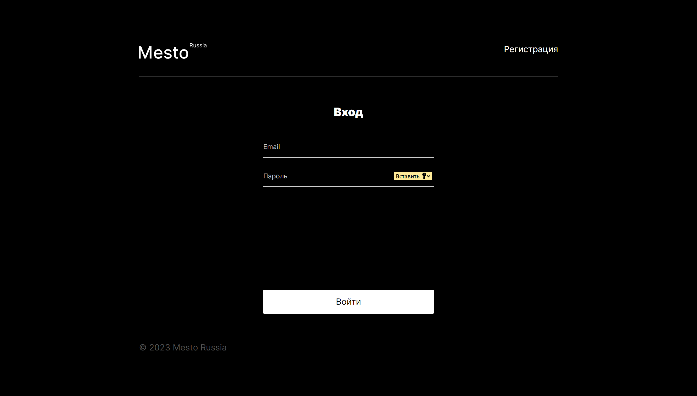
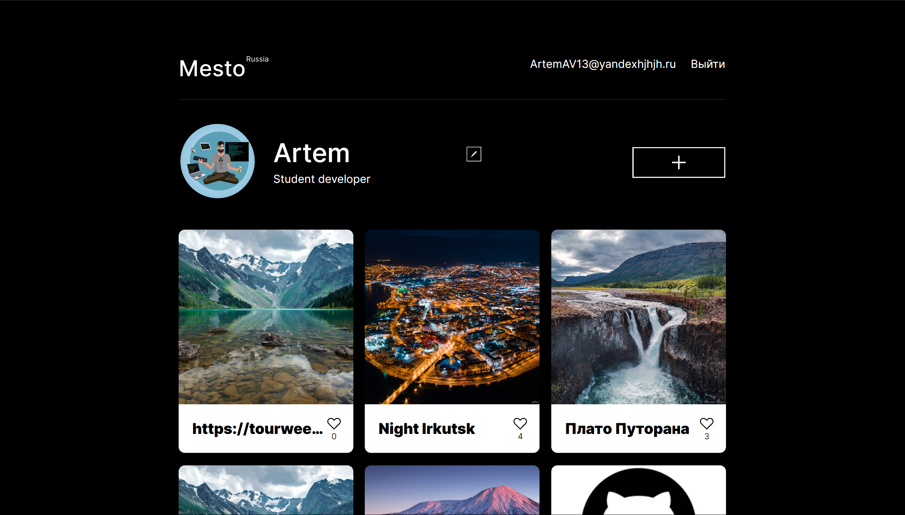

# Проект "React-mesto-auth"🌍

###

  

  

### 📜Описание:
React-mesto-auth - это учебный проект в возможностью регистриции и авторизации, выполненный на React, который представляет собой веб-приложение для просмотра и добавления фотографий мест со всего мира. Выполнен в рамках серии проектных работ в Яндекс.Практикуме по профессии «Веб-разработчик» (от начала изучения React, спринт 11).

[Ссылка на проект React-mesto-auth на GitHub](https://asaevartemv.github.io/react-mesto-auth/)

### 🪄 Функционал:
1. Регистрация и авторизация🆔: Пользователи могут создать свой аккаунт, зарегистрировавшись с помощью электронной почты и пароля, либо войти в систему, используя свои учетные данные.

2. Редактирование профиля👤: Зарегистрированные пользователи могут изменять свое имя, статус и загружать собственное изображение в аватурку. Это позволяет пользователям настраивать свой профиль по своему усмотрению.

3. Создание и удаление карточек🌄: Пользователи могут создавать карточки с изображениями и названиями. Они также имеют возможность удалять свои карточки, которые им больше не нужны.

4. Лайки на карточках❤️: Пользователи могут выражать свое восхищение карточками, ставя лайк. Количество лайков отображается на каждой карточке.

5. Увеличение карточек по клику🔍: При клике на карточку она увеличивается для более детального просмотра. Это позволяет лучше рассмотреть изображение.

6. Взаимодействие с серверной частью🖥: Все данные о пользователях, карточках и профилях хранятся на сервере. Проект обеспечивает обмен данными с сервером для загрузки информации и сохранения изменений.

7. Модальные окна🪟: Пользователи могут открывать и закрывать модальные окна для выполнения различных действий, таких как редактирование профиля, добавление новой карточки, обновление аватара, увеличение фото и уведомления о регистрации.

🤩 Этот функционал делает проект Mesto react auth удобным и интерактивным, позволяя пользователям регистрироваться, создавать и редактировать профили, взаимодействовать с карточками, а также взаимодействовать с серверной частью для хранения данных.

### 🛠️ Технологии:
1. Flexbox
2. Grid Layout
3. Positioning Elements
4. Animation and Transform using CSS
5. BEM Methodology
6. File Structure and File Paths (Nested BEM)
7. Git
8. JavaScript (Asynchronous JS, OOP, Fetch API)
9. Webpack
10. React JS
11. React Router
12. Functional Components

### 🗂️ Файловая структура:
- Проект следует структуре БЭМ (Nested), что способствует организации и читаемости кода.

### 🚀 Установка и запуск:
Для запуска проекта локально, выполните следующие шаги:

1. Склонируйте репозиторий на свой компьютер: https://github.com/AsaevArtemV/react-mesto-auth
2. Перейдите в папку проекта: cd react-mesto-auth
3. Установите зависимости: npm i
4. Запустите проект: npm start

✅Это запустит проект на локальном сервере, и вы сможете просматривать его в браузере по адресу: 🔗 http://localhost:3000/.